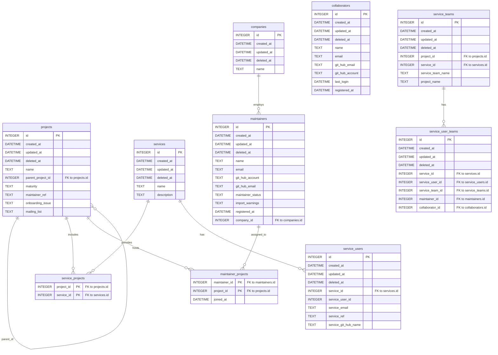

# Deployment notes

MaintainerD - input data (List of Projects and associated Maintainers) 

## Kubernetes resources overview


    deploy -->|creates| pod
    deploy -->|mounts| pvc
    deploy -->|envFrom| secrets
    deploy -->|imagePullSecrets| ghcr
    pod -->|exposes 2525| svc
    svc -->|TLS| tls
    pod -->|volumeMount| pvc


## Maintainer Database ER diagram




## init-container
 - bootstrap process loads project and maintainer data from 
   - a CNCF-Internal worksheet 
   - in future, should be loaded from a combination of PCC user profiles (keyed by GitHub user account) and a registered list of project.yaml files on a per-project basis. 

## GitHub Event Listener

### cert-manager
Manages the server cert associated with the maintainer-d event listener that listens for changes to onboarding issues.

Steps to integrate with Let's Encrypt on OKE:

1. Create the OCI DNS credentials secret:
   ```bash
   kubectl create secret generic oci-dns-credentials -n cert-manager \
     --from-literal=tenancyOCID=<tenancy_ocid> \
     --from-literal=userOCID=<user_ocid> \
     --from-literal=fingerprint=<api_key_fingerprint> \
     --from-file=privateKey=<path_to_api_key_private_key_pem>
   ```
2. Apply a `ClusterIssuer` using the OCI DNS solver (update compartment OCID, DNS zone, and email):
   ```yaml
   apiVersion: cert-manager.io/v1
   kind: ClusterIssuer
   metadata:
     name: letsencrypt-dns
   spec:
     acme:
       email: you@example.com
       server: https://acme-v02.api.letsencrypt.org/directory
       privateKeySecretRef:
         name: letsencrypt-dns-account-key
       solvers:
       - dns01:
           oci:
             compartmentOCID: ocid1.compartment.oc1..aaaaaaaa22icap66vxktktubjlhf6oxvfhev6n7udgje2chahyrtq65ga63a
             dnsZoneName: cncf.io.
             secretRef:
               name: oci-dns-credentials
               key: privateKey
             tenancyOCID: ocid1.tenancy.oc1...            # must match the secret
             userOCID: ocid1.user.oc1...                  # must match the secret
             fingerprint: <api_key_fingerprint>
   ```
3. Request the certificate in the `maintainerd` namespace:
   ```yaml
   apiVersion: cert-manager.io/v1
   kind: Certificate
   metadata:
     name: maintainerd-cert
     namespace: maintainerd
   spec:
     secretName: maintainerd-tls
     issuerRef:
       name: letsencrypt-dns
       kind: ClusterIssuer
     dnsNames:
     - github-events.cncf.io
   ```
4. Update `deploy/manifests/service.yaml` to expose HTTPS and reference the secret:
   ```yaml
   metadata:
     annotations:
       service.beta.kubernetes.io/oci-load-balancer-ssl-ports: https
       service.beta.kubernetes.io/oci-load-balancer-tls-secret: maintainerd/maintainerd-tls
   spec:
     ports:
     - name: http
       port: 80
       targetPort: 2525
     - name: https
       port: 443
       targetPort: 2525
   ```
5. Apply the manifests (`kubectl apply -f deploy/manifests/service.yaml`) and verify:
   - `kubectl describe certificate maintainerd-cert -n maintainerd`
   - `kubectl get secret maintainerd-tls -n maintainerd`
   - `curl -vk https://github-events.cncf.io/healthz`

Ensure your OCI IAM policies allow the OKE dynamic group to manage DNS records in the relevant compartment; otherwise the ACME solver cannot create the TXT challenges.
